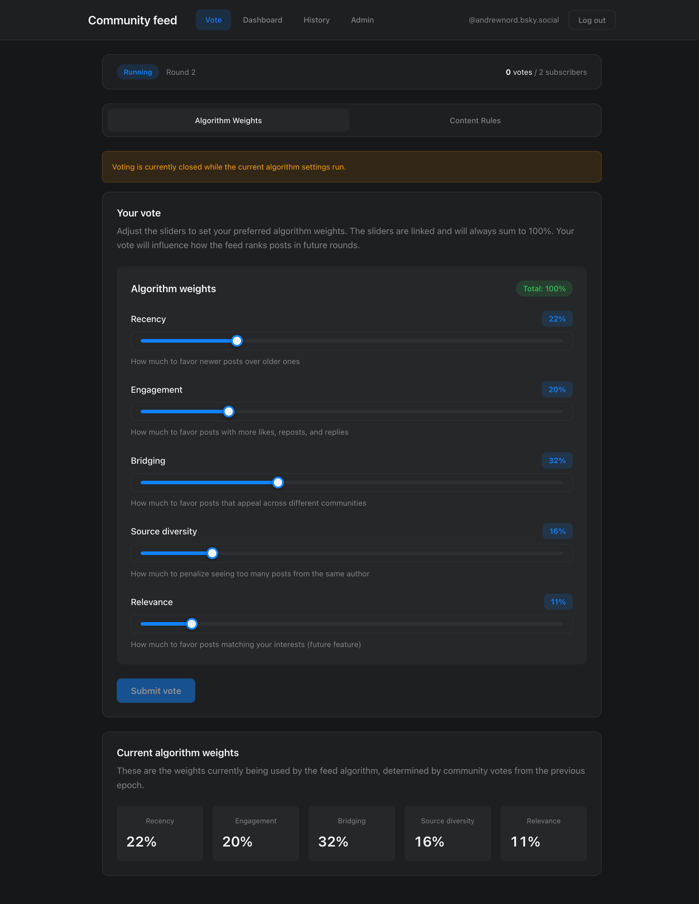
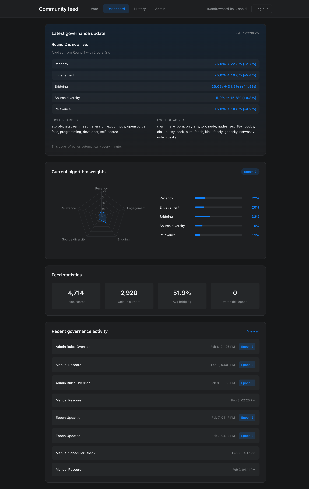
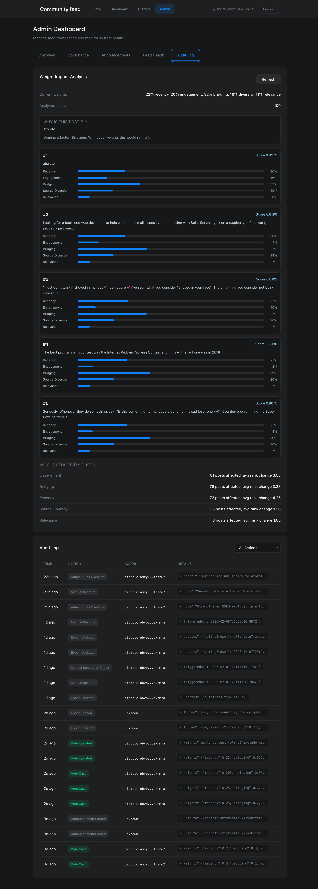
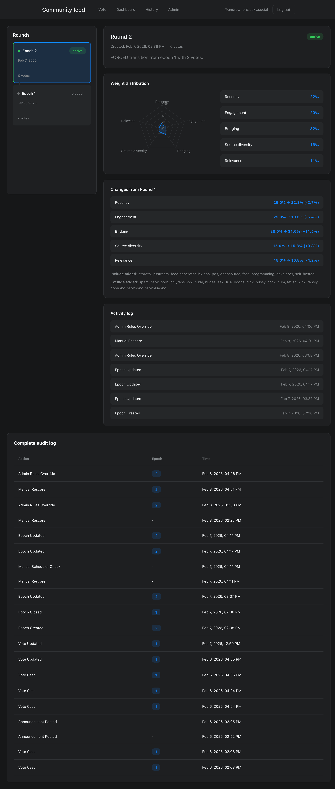
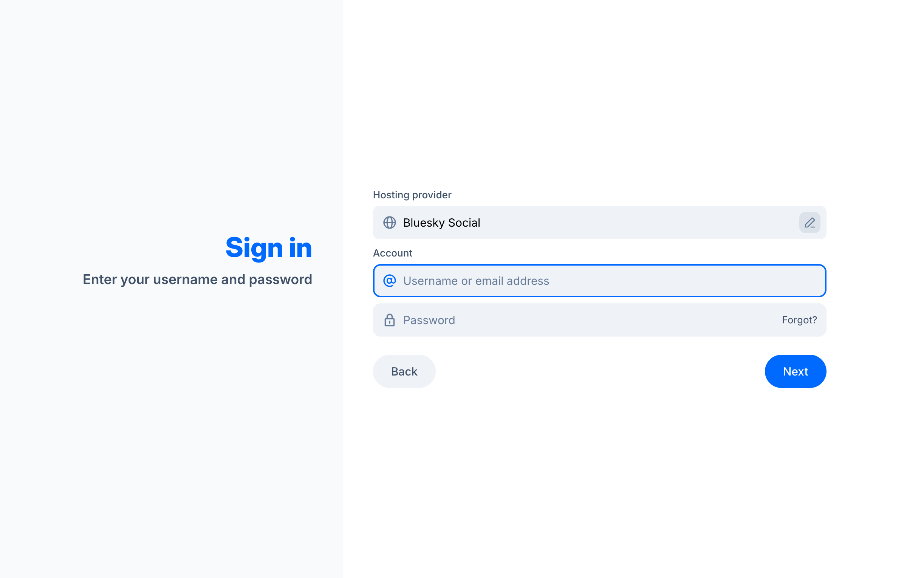

# Community-Governed Bluesky Feed

[](https://github.com/AndrewNordstrom/bluesky-community-feed/actions/workflows/deploy.yml)
[](https://opensource.org/licenses/MIT)
[](https://nodejs.org/)

A production Bluesky custom feed where subscribers democratically vote on ranking behavior (weights + content rules), and the backend applies those decisions in a transparent scoring pipeline.

This project supports an NSF research question: can communities meaningfully govern their own algorithms?

---

## Try It Now

**No coding required** — just a Bluesky account.

1. **Add the feed** — Open Bluesky and search "Community Governed" in Feeds, or click:
   [View feed on Bluesky](https://bsky.app/profile/corgi-network.bsky.social/feed/community-gov)

2. **Vote on the algorithm** — Sign in with your Bluesky handle + [app password](https://bsky.app/settings/app-passwords):
   [feed.corgi.network/vote](https://feed.corgi.network/vote)

3. **See the transparency dashboard** — View current weights, vote history, and score breakdowns:
   [feed.corgi.network/dashboard](https://feed.corgi.network/dashboard)

Your vote affects how posts are ranked in future governance rounds.

---

## Screenshots

<details>
<summary>Click to expand</summary>

### Feed in Bluesky


### Governance Voting


### Transparency Dashboard


### Admin Audit View ("Why #1?")


### Round History


### Bot Announcement Post


</details>

---

## Live Deployment

- Feed: [feed.corgi.network](https://feed.corgi.network)
- Bot account: [@corgi-network.bsky.social](https://bsky.app/profile/corgi-network.bsky.social)

## Core Features

- Community governance on 5 ranking components: `recency`, `engagement`, `bridging`, `source_diversity`, `relevance`
- Content-rule voting (`include` / `exclude` keywords)
- Score decomposition persisted per post per epoch (raw + weighted + total)
- Fast feed serving via Redis snapshots and stable cursors
- Admin controls, audit log, health dashboard, and transparency endpoints
- Jetstream ingestion with cursor persistence and reconnect resilience

## Architecture

```text
GOVERNANCE (Vote UI + APIs) -> epoch weights/content rules
         |
         v
SCORING PIPELINE (scheduled batch) -> post_scores + feed snapshot in Redis
         |
         v
INGESTION (Jetstream -> PostgreSQL) + FEED SERVING (XRPC getFeedSkeleton)
```

## Tech Stack

- Backend: Node.js 20, TypeScript 5, Fastify 5
- Data: PostgreSQL 16, Redis 7
- Frontend: React 19, Vite 7
- Protocol libs: `@atproto/api`, `@atproto/xrpc-server`

## Quickstart (Local)

### 1. Install dependencies

```bash
npm install
cd web && npm install && cd ..
```

### 2. Configure environment

```bash
cp .env.example .env
```

Minimum required variables:
- `FEEDGEN_SERVICE_DID`
- `FEEDGEN_PUBLISHER_DID`
- `FEEDGEN_HOSTNAME`
- `JETSTREAM_URL`
- `DATABASE_URL`
- `REDIS_URL`
- `BSKY_IDENTIFIER`
- `BSKY_APP_PASSWORD`
- `BOT_ADMIN_DIDS`

Use `.env.example` for the full set, defaults, and comments.

### 3. Start local dependencies

```bash
docker compose up -d
```

### 4. Run migrations

```bash
npm run migrate
```

### 5. Build and run backend

```bash
npm run build
npm run dev
```

### 6. Run frontend (separate terminal)

```bash
cd web
npm run dev
```

## Quality Gates

Run before pushing:

```bash
# backend
npm run build
CI=1 npm test -- --run

# frontend
cd web
npm run lint
npm run build
```

## API Surface (High-Level)

Public:
- `GET /xrpc/app.bsky.feed.getFeedSkeleton`
- `GET /xrpc/app.bsky.feed.describeFeedGenerator`
- `GET /.well-known/did.json`
- `GET /health`, `GET /health/ready`, `GET /health/live`

Governance:
- `/api/governance/auth/*`
- `/api/governance/vote`
- `/api/governance/weights/*`
- `/api/governance/content-rules/*`
- `/api/governance/epochs/*`

Admin:
- `/api/admin/*` (governance controls, feed health, scheduler, announcements, audit)

See source route registration in `src/feed/server.ts`.

## Security and Integrity Invariants

- Score decomposition is always persisted; never store only `total_score`
- Scores are always tagged with `epoch_id`
- Governance audit log is append-only (DB-enforced)
- Weight sums are validated (DB/API/UI)
- `getFeedSkeleton` avoids external API calls and serves from local data
- Feed JWT handling is verification-based and availability-safe

## Deployment and Operations

- Deployment guide: `docs/DEPLOYMENT.md`
- Operations runbook: `docs/OPS_RUNBOOK.md`
- Security guide: `docs/SECURITY.md`

## Documentation Index

- System overview: `docs/SYSTEM_OVERVIEW.md`
- Full implementation spec: `docs/IMPLEMENTATION_SPEC.md`
- Admin dashboard spec: `docs/ADMIN_DASHBOARD_SPEC.md`
- Stability and test guidance: `docs/STABILITY_TEST.md`
- Contributor guide: `CONTRIBUTING.md`

## Contributing

PRs are welcome. Read `CONTRIBUTING.md` and keep changes aligned to project invariants and quality gates.

## Citation

If you use this system in research or demos, cite the repository URL and commit SHA used for your analysis.

## License

MIT — see `LICENSE`.
